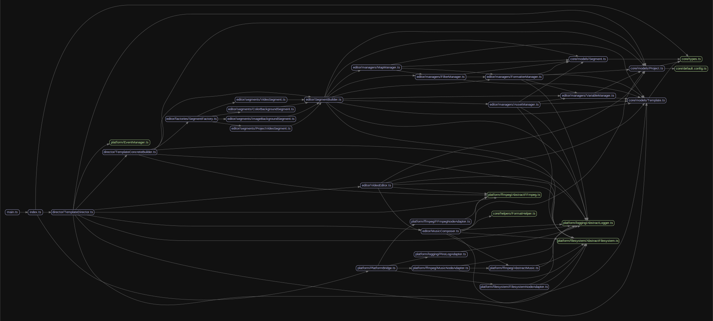

# FFmpeg Template Assembly

`ffmpeg-template-assembly` is a powerful tool designed to streamline the process of video compilation using FFmpeg. It allows for dynamic template generation and video rendering, making it an ideal solution for creating personalized videos programmatically.

## Description

This project leverages FFmpeg for video processing, providing an interface to compile videos based on a template descriptor and project configuration. It simplifies the process of generating custom videos by handling complex FFmpeg commands and configurations internally.

## Getting Started

### Dependencies

Ensure you have the following prerequisites installed:

- Node.js (v18.x or higher)

### Installing

Clone the repository and install the dependencies:

```bash
git clone https://github.com/heristop/ffmpeg-template-assembly.git
cd ffmpeg-template-assembly
pnpm i
```

### Configuration

Create a JSON file (e.g., `sample.json`) in the `src/shared/templates` directory with your template descriptor.

### Usage

#### Command Line Interface

To use the `ffmpeg-template-assembly`, you can run the compile command with the path to your template JSON file as an argument:

```bash
pnpm compile src/shared/templates/sample.json
```

This will generate a video named `sample_output.mp4` in the `build` directory.

#### Compilation Function

Import the `compile` function from the package and provide a project configuration object:

```javascript
import { compile } from 'ffmpeg-template-assembly';

// Project Configuration
const projectConfig: ProjectConfig = {
  assetsDir: './src/shared/assets',
  currentLocale: 'en',
  fields: {
    form_1_firstname: 'Firsname',
    form_1_lastname: 'Lastname',
    form_1_job: 'Developer',
    form_2_keyword1: 'One',
    form_2_keyword2: 'Two',
    form_2_keyword3: 'Three',
  },
};
```

You might provide a template descriptor to the `compile` function to generate a video:

```javascript
const templateDescriptor = {
  "global": {
    "variables": {
      "videoDemo": "https://github.com/heristop/ffmpeg-template-assembly/raw/develop/src/shared/assets/videos/earth.mp4",
      "colorsList": ["#FFFFFF","#000000"]
    },
    "orientation": "landscape",
    "musicEnabled": true,
    "transitionDuration": 0.5
  },
  "sections": [
    {
      "name": "readme_video",
      "type": "project_video",
      "visibility": ["video_segment"],
      "options": {
        "backgroundColor": "{{ color1 }}@0.1",
        "videoUrl": "{{ videoDemo }}",
        "duration": 0.5,
        "musicVolumeLevel": 0.4
      },
      "filters": [
        {
          "type": "drawbox",
          "values": {
            "x": 0,
            "y": 0,
            "w": 1280,
            "h": 360,
            "c": "{{ color2 }}@1",
            "t": "fill"
          }
        },
        {
          "type": "drawtext",
          "values": {
            "text": {
              "en": "{{ form_1_firstname }} {{ form_1_lastname }}"
            },
            "fontcolor": "#FFFFFF",
            "fontsize": 40,
            "x": "(w-text_w)/2",
            "y": "(h-text_h)/1.4",
            "fontfile": "Quicksand.ttf",
            "alpha": "'if(lt(t,0.5),0,if(lt(t,1.5),(t-0.5)/1,if(lt(t,5),1,if(lt(t,7),(1-(t-6))/1,0))))'"
          }
        },
      ]
    }
  ]
};


await compile(projectConfig, templateDescriptor);
```

Or you might provide a path to the template descriptor JSON file:

```javascript
const templatePath = './src/shared/templates/sample.json';

await compile(projectConfig, templatePath);
```

## Running Tests

To run tests, use the following command:

```bash
pnpm test
```

## Architecture

[](graph.svg)

## Contributing

Contributions are welcome! For major changes, please open an issue first to discuss what you would like to change. Ensure to update tests as appropriate.

## License

This project is licensed under the MIT License - see the [LICENSE](LICENSE) file for details.
